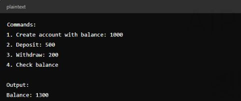
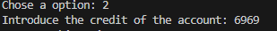
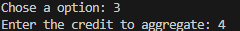
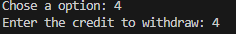

# Simple banking system

## Description
Build a simple banking system with basic functionalities like creating an account, depositing, withdrawing, and checking the balance.

## Requirements
The program should support creating a new account with an initial balance.

It should allow deposits and withdrawals.

It should display the current balance.

## Example

        
## Libraries and Tools

No external libraries required.

## Hints

- Use a dictionary to store account information.

- Implement functions for deposit, withdrawal, and balance check.

## Topics to Study

- Dictionary data structure

- Functions and error handling

## Methodological Steps

- Define data structures: Use a dictionary to store account details.

- Implement banking operations: Write functions for creating accounts, depositing, withdrawing, and checking balances.

- User interaction: Use a loop to handle user commands.

- Validate transactions: Ensure sufficient funds for withdrawals and valid inputs.
Best Practices

- Use clear prompts: Guide the user with informative prompts and error messages.

- Secure data: Consider how data might be stored securely in a real application.

- Write reusable code: Functions for each operation can be reused in different parts of the program.

# Project

The project is a banking system that allows credit to be deposited and withdrawn from an account.

The project in operation it see like this:

Below I will show each function one by one:

This option shows the current balance in the account 

This option changes the current balance in the account to another

This option adds a defined balance amount to the current account balance

This option removes a defined balance amount from the account balance

# Architecture

The project has three folders in the rsc, db, and src. In rsc, there are only a couple of images used in the readme; in db, there's a file containing the account balance; and in src, there's the main file and a series of modules in a separate folder.

# Run & Configure

- Installation

Clone the repository:

git clone https://github.com/kevin-pb/python-proyect-simple-banking-system.git

- Run

python main.py
